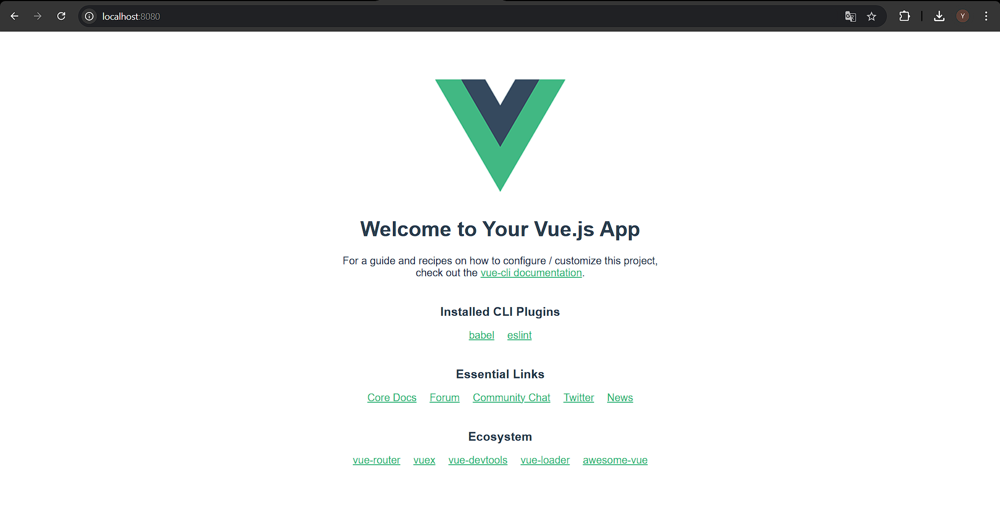
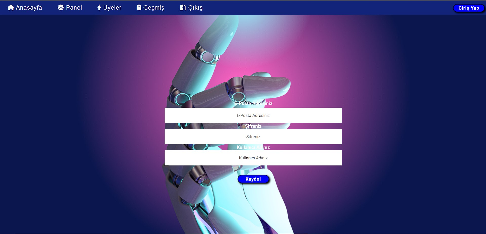
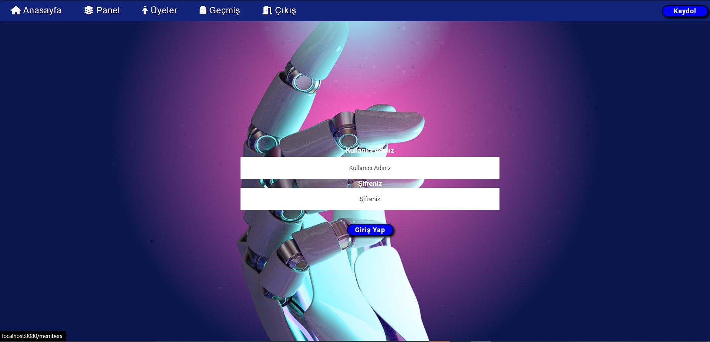
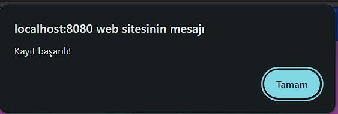
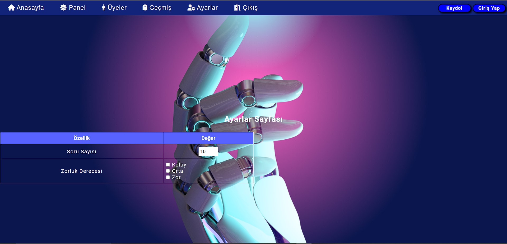
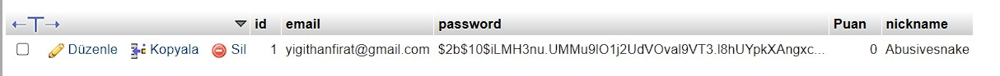
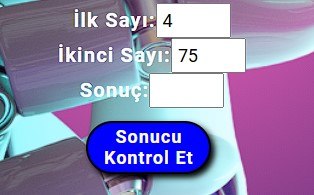

# Web Tabanlı Matematiksel İşlem Uygulamaları

Bitirme Projesi

## Proje Dosyaları ve Çalıştırma

### Header

Headera ait bölümler ve butonlar oluşturuldu, stillendirildi. Eksik olan Ayarlar kısmı headera eklendi.

### Register ve Login Page

Register ve Login sayfaları vue.js ile tasarımları yapıldı. Gerekli yönlendirmeler de eklendikten sonra kullanıcı kayıt ve girişleri backend olarak halledildi. server.js dosyasıyla birlikte node.js kullanılarak  veritabanı bağlantısı kuruldu ve bu şekilde sayfaların tasarımlarının sonrasında da veritabanı kayıtları tamamlandı.

### Kayıt Ekranı, Giriş Ekranı ve Kayıt Bildirimi

### Settings Kısmına Ait Fotoğraflar

### Footer Tasarımı

Footer tasarımı transparan olacak şekilde yapılarak Github yönlendirmesi eklenerek tamamlandı. Tasarım tamamlandıktan sonra oluşan hatalar giderildi.

### Rastgele Sayı Üretimi

Sayıların sayfa açılışıında rastgele üretilmesi sağlandı ve kod bütünlüğü sağlandı.

