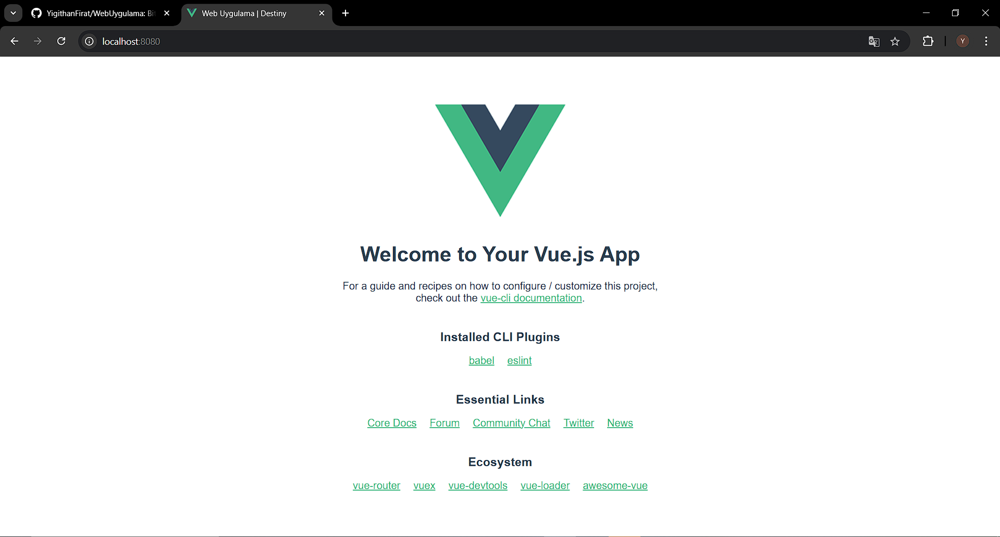
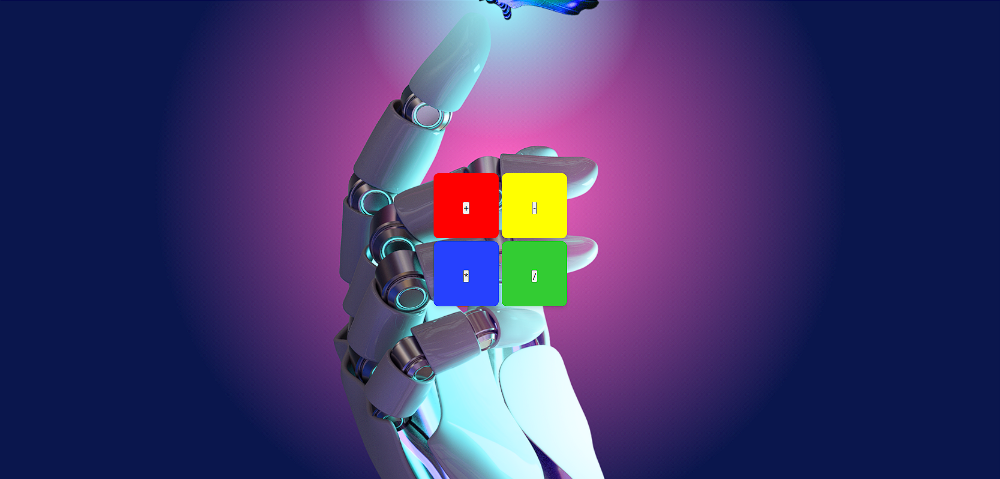
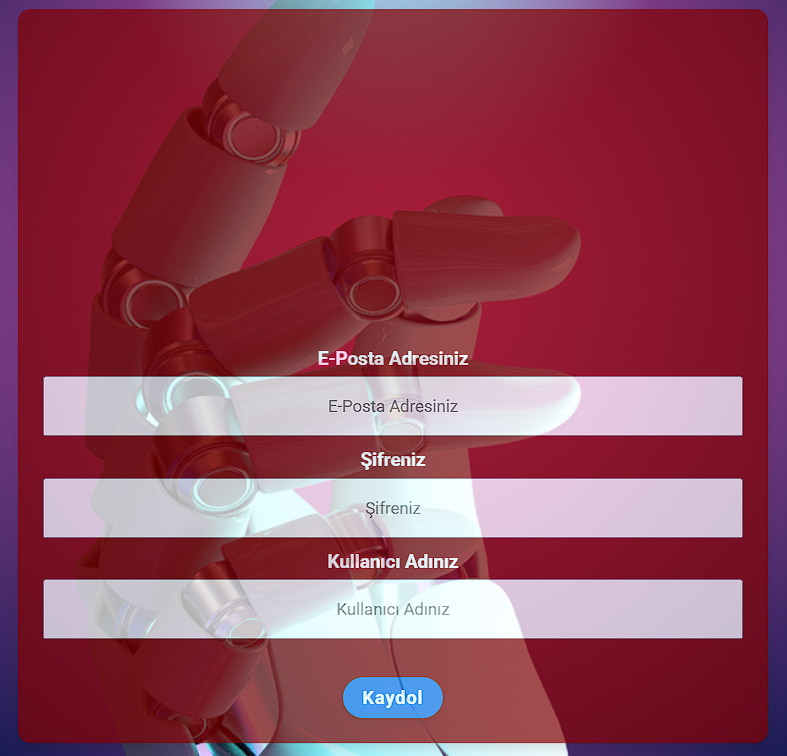
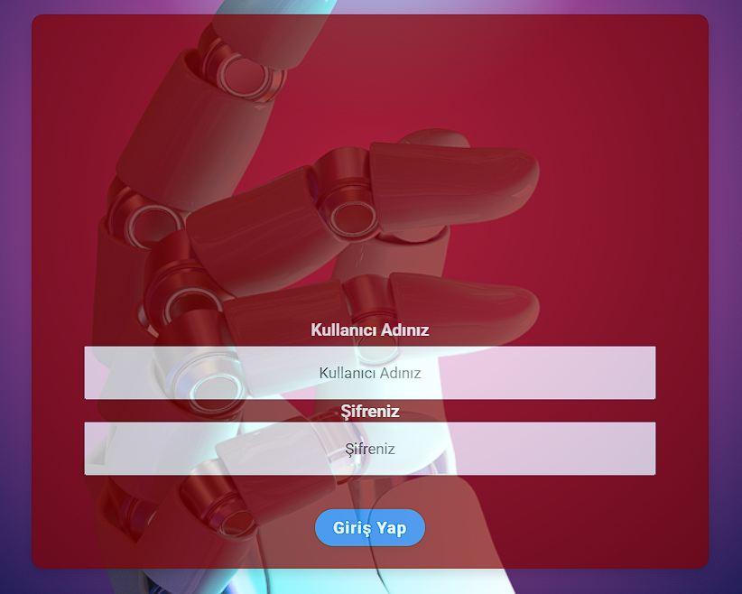
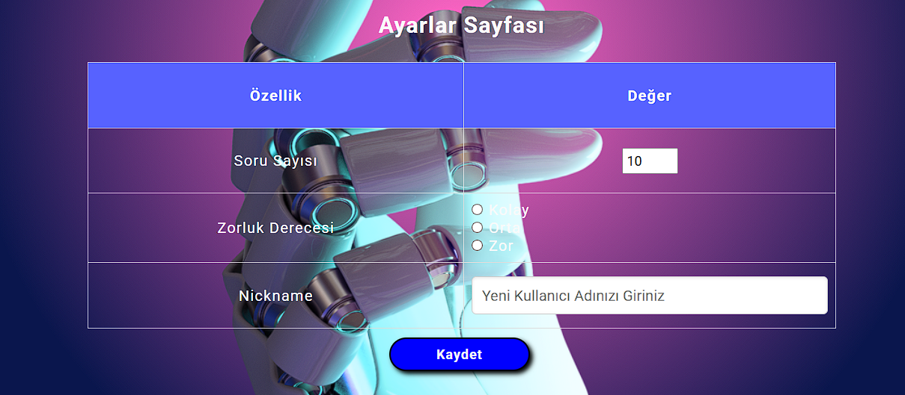

# Web Tabanlı Matematiksel İşlem Uygulamaları

Bitirme Projesi

## Proje Dosyaları ve Çalıştırma

## Open Page
Açılan ilk pencerede işlem seçimi yapılarak sonrasında anasayfaya yönlendirilmesi sağlanmıştır.

## Header 1

Headera ait bölümler ve butonlar oluşturuldu, stillendirildi. Eksik olan Ayarlar kısmı headera eklendi.

### Register ve Login Page

Register ve Login sayfaları vue.js ile tasarımları yapıldı. Gerekli yönlendirmeler de eklendikten sonra kullanıcı kayıt ve girişleri backend olarak halledildi. server.js dosyasıyla birlikte node.js kullanılarak  veritabanı bağlantısı kuruldu ve bu şekilde sayfaların tasarımlarının sonrasında da veritabanı kayıtları tamamlandı.

### Settings Kısmına Ait Fotoğraflar
Ayarlar kısmına ait sayfadır, kullanıcı bir çok bilgilerini buradan güncelleyebilmektedir.

